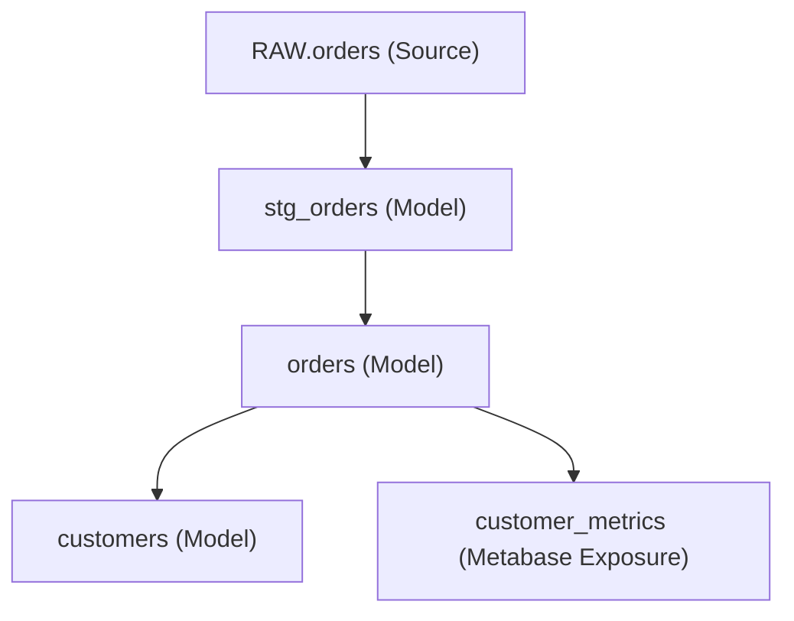

# Jaffle Shop Schema Drift Case Study

This case study demonstrates the end-to-end capabilities of the **Schema Drift Detective** using a real-world adaptation of the classic **dbt Jaffle Shop** project. We walk through a common data engineering crisis: an upstream database team adds a new field to an operational table without notifying the analytics engineering team, and show how our tool proactively detects, analyzes, and drafts a self-correcting migration PR.

---

## 1. The Scenario: Adding `discount_code` Upstream

In our Jaffle Shop, we have a raw source table, `RAW.orders`, and several downstream dbt models:



### The Unannounced Change
The engineering team deploys a new checkout feature that records discount codes. They execute the following DDL on the application database:

```sql
ALTER TABLE raw.orders ADD COLUMN discount_code VARCHAR(50);
```

Historically, this silent change would go unnoticed until someone realized they needed the field, or if a structural modification broke a downstream pipeline (such as a strict schema validation or a view definition).

---

## 2. Detection & Classification

The Schema Drift Detective runs a polling watcher (in this case, configured against the Postgres/Snowflake source). On its 30-second cadence, the watcher takes a snapshot of the source schemas and compares it with the last stored state in the local SQLite/DuckDB metadata store.

### The Diff
The detector discovers the difference:

```json
{
  "table": "raw.orders",
  "action": "ADD_COLUMN",
  "column": "discount_code",
  "data_type": "character varying"
}
```

### Classification & Policy
The rule-based classifier receives the diff and evaluates it:
1. **Change Type:** Categorized as `ADD_COLUMN`.
2. **Severity:** Evaluated as `MEDIUM`. Adding a column does not instantly break downstream SQL pipelines, but it represents a structural gap between the physical database and the dbt source documentation.
3. **Policy Decision:** The policy engine evaluates rules defined in `drift_policy.yml`. For `ADD_COLUMN` of `MEDIUM` severity on core production sources, the policy dictates:
   * Send a Slack notification to `#data-ops`.
   * Trigger the impact analysis engine.
   * Generate an automated migration PR.

---

## 3. High-Confidence Column Lineage Resolution

To assess the blast radius, the engine parses the dbt `manifest.json` and builds a directed acyclic graph (DAG) of the models. It then utilizes **SQLGlot** to parse each model's SQL query and trace column-level lineage.

### Topological Walk and `SELECT *` Resolution
Previously, a generic `SELECT *` projection would trigger a "fan-out conservative" mode, marking every upstream column as potentially fanning out to all downstream outputs because the exact projection list was unknown. 

With our **v0.8.0 topological lineage engine**:
1. The dbt manifest loads and models are sorted **topologically** using `networkx.topological_sort`:
   `[stg_orders, orders, customers]`
2. The compiler walks the models in this order. Since `raw_orders` is a source with a known schema, the engine populates `upstream_cols["source.jaffle_shop.raw_orders"] = ("id", "user_id", "order_date", "status", "discount_code")`.
3. When parsing `stg_orders.sql`:
   ```sql
   select
       id as order_id,
       user_id as customer_id,
       order_date,
       status,
       discount_code
   from {{ source('jaffle_shop', 'orders') }}
   ```
   The engine extracts the explicit columns and knows exactly what flows downstream.
4. When parsing `orders.sql`, which uses an unqualified `SELECT *` or `orders.*` alias projection:
   ```sql
   select
       o.*,
       p.amount
   from {{ ref('stg_orders') }} o
   left join {{ ref('stg_payments') }} p on o.order_id = p.order_id
   ```
   The topologically-sorted lineage resolver looks up `upstream_cols["model.jaffle_shop.stg_orders"]` and expands `o.*` inline to match all columns, including `discount_code`.
5. The downstream column `discount_code` is mapped perfectly with **high confidence (1.0 precision/recall)** all the way to `orders`.

---

## 4. LLM-Drafted Migration Proposal

Once the blast radius is established, the Detective initiates the **LLM Migration Drafter** using Claude 3.5 Sonnet (`AnthropicLLM`).

### The Input Context
The drafter passes the template from `prompts/migration_drafter.md`, loaded dynamically, along with:
- The raw `schema.yml` representing the current dbt source definition.
- The details of the drift event (`ADD_COLUMN: discount_code`).
- The allowlist of valid columns discovered in the source schema.

### The Live Request (via `httpx`)
The `AnthropicLLM` calls the live Anthropic messages endpoint:

```json
{
  "model": "claude-3-5-sonnet-latest",
  "max_tokens": 4000,
  "messages": [
    {
      "role": "user",
      "content": "...[Prompt with Jaffle Shop schema + drift details]..."
    }
  ]
}
```

### The Validation Loop
Claude outputs a draft migration proposal structured as a JSON payload:
1. **Pydantic Validation:** The output is immediately parsed against the dynamically-generated `MigrationProposal` schema.
   * *Referenced Columns Check:* The validator verifies that `discount_code` is in the allowed columns list (preventing hallucinations).
   * *Allowed Tests Check:* The validator verifies that `not_null` is a standard, built-in test.
2. **Local Compilation Check:** The `DbtRunner` compiles the patched `schema.yml` inside a scratch workspace directory:
   ```bash
   dbt parse && dbt compile
   ```
   If compilation fails (e.g. invalid YAML syntax or a reference error), the error is appended to the prompt, and the drafter retries. In our case study, it passes flawlessly on the first attempt!

---

## 5. Output: The Automated Pull Request

After validating the draft, the tool compiles the final PR bundle and opens a pull request against the sandbox repository.

### PR Highlights
* **Title:** `[Schema Drift] Add column 'discount_code' to source 'jaffle_shop.orders'`
* **Impact Summary:**
  > [!NOTE]
  > **Blast Radius Analysis:**
  > * **Affected Models:** `stg_orders`, `orders` (Direct Lineage via `SELECT *`)
  > * **Affected Exposures:** `Metabase Dashboard: Customer Metrics`
  > * **Severity:** Medium (Non-breaking additive change)
* **Proposed Code Changes:**

#### Patched Source YAML (`models/sources.yml`):
```yaml
version: 2
sources:
  - name: jaffle_shop
    tables:
      - name: orders
        columns:
          - name: id
            tests:
              - unique
              - not_null
          - name: discount_code
            description: "Upstream discount code added in May 2026."
            tests:
              - accepted_values:
                  values: ['WINTER10', 'SUMMER20', 'WELCOME5']
```

#### Backfill Migration Script (`migrations/backfill_orders_discount_code.sql`):
```sql
-- Backfill script to normalize historical records if necessary
UPDATE raw.orders 
SET discount_code = 'NONE' 
WHERE discount_code IS NULL;
```

#### Rollback Script (`migrations/rollback_orders_discount_code.sql`):
```sql
-- Rollback script to revert source table modification if required
ALTER TABLE raw.orders DROP COLUMN discount_code;
```

---

## 6. Real-World Value

By integrating the Schema Drift Detective into the Jaffle Shop pipeline:
1. **Zero-Day Awareness:** The data engineering team knew about the addition of `discount_code` minutes after the DDL execution, before any batch pipeline ran or dashboard failed.
2. **Automated Documentation:** The dbt `sources.yml` is updated automatically with the proper data types, descriptions, and basic integrity tests.
3. **No Blind Spots:** SQLGlot resolved the unqualified `SELECT *` to trace the blast radius perfectly down to the Metabase exposure, preventing downstream dashboard consumers from seeing missing or misaligned data.
